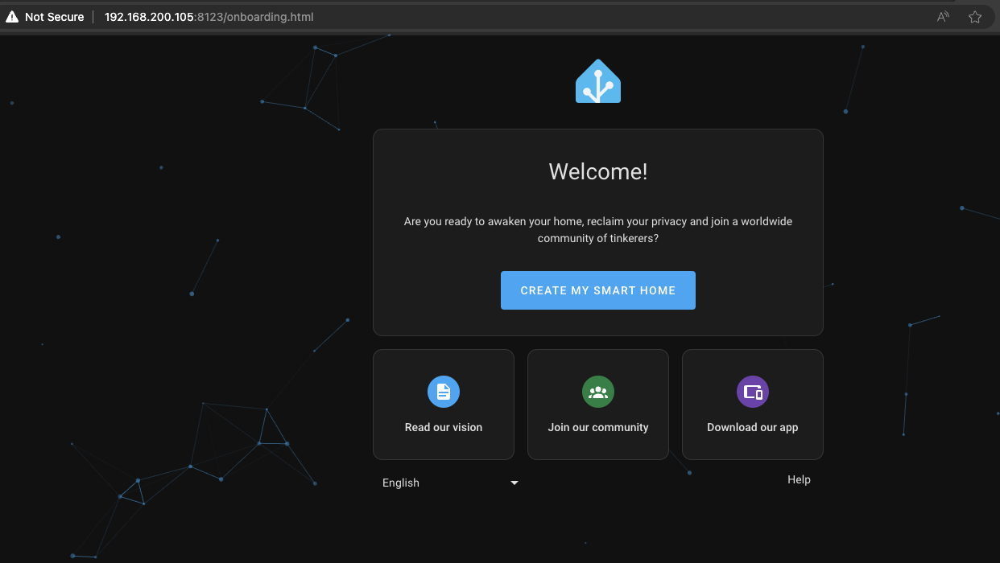
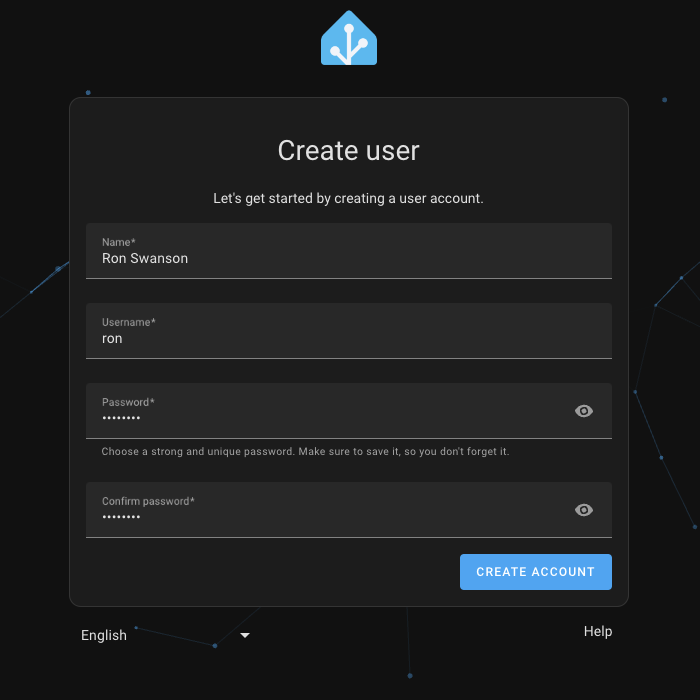
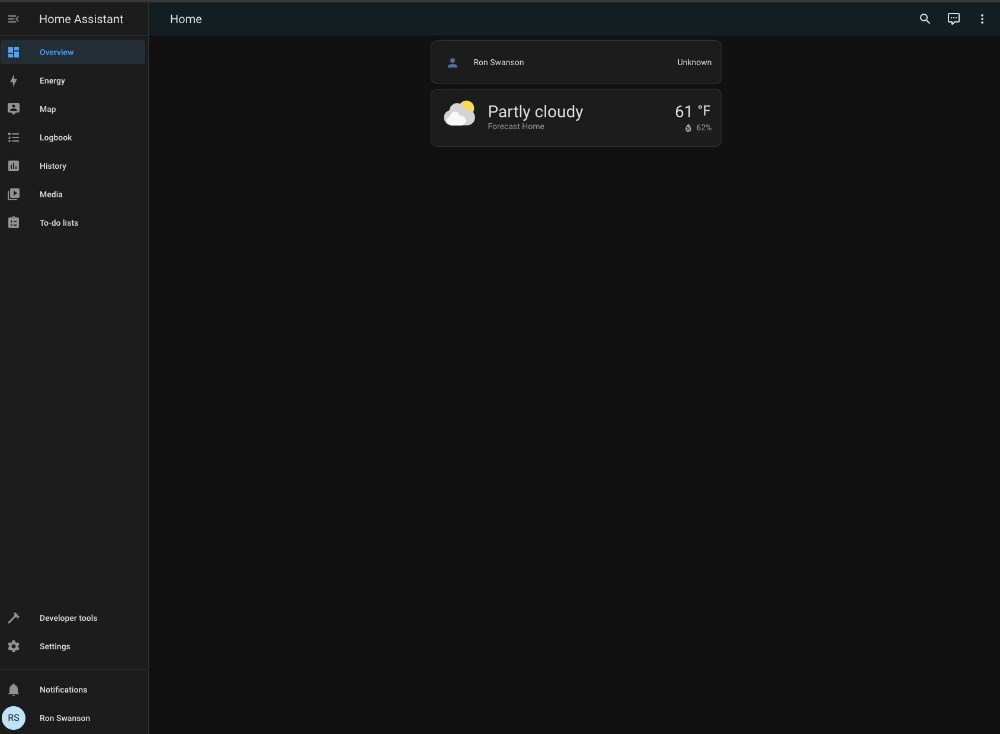
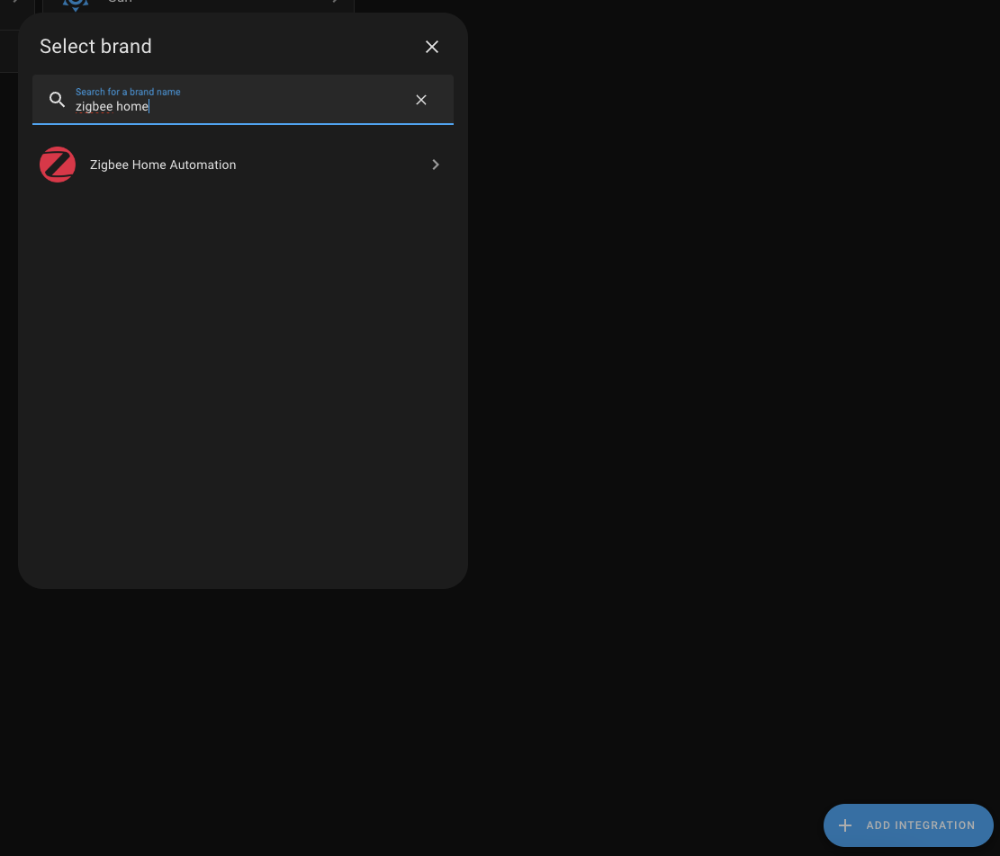

# Home Automation with Docker
## Running Home Assistant with Docker Compose

### Overview
This guide is a demonstration of how to leverage Docker and Docker Compose to run Home Assistant. I won't be walking through how to get Linux installed or diving technically deep into how Docker or containers works. For this guide, the steps are tested with Ubuntu 22.04 running on a Raspberry Pi 4. They should work just the same on other baremetal installs of Ubuntu 22.04. The commands may vary depending on the distribution.

If you run on Windows or MacOS, you'll need Rancher Desktop or Docker Desktop. I wouldn't recommend running Home Assistant on Windows or MacOS unless you know the limits those operating systems present.

With that said here are some resources:
- If you want to try this out on a Windows or MacOS desktop use [Rancher Desktop](https://rancherdesktop.io/) or [Docker Desktop](https://www.docker.com/products/docker-desktop/).
  - Rancher Desktop by default uses containerd as the container engine. Change the container engine to dockerd for maximum compatability. Here's a link on [how to change your container engine in Rancher Desktop](https://docs.rancherdesktop.io/ui/preferences/container-engine/general).
  - Docker Desktop is free for personal use but requires a paid subscription for most professional usage and is not an open source product.
  - Your mileage may vary on passing through hardware devices to the Home Assistant container.
- If you want to run this on a full Linux install, here are some links on getting Ubuntu Server and Raspberry Pi OS running. I would recommend Ubuntu Server on baremetal.
  - [Installing Ubuntu Server on Proxmox](https://www.youtube.com/watch?v=YR9SNDD8WB4) after you've installed [Proxmox](https://www.youtube.com/watch?v=7OVaWaqO2aU)
  - [Installing Raspberry Pi OS on a Raspberry Pi 4](https://www.youtube.com/watch?v=gyMpI8csWis)
  - [Install Ubuntu Server on baremetal](https://ubuntu.com/tutorials/install-ubuntu-server#1-overview)

### 1. Installing required packages
We'll need to install the following packages on our Ubuntu box:
- git
- ca-certificates
- docker.io
- docker-compose

Run the snippet below to install the required packages:
```bash
sudo apt update
sudo apt install -yq \
    git \
    ca-certificates \
    docker.io \
    docker-compose
```

You may also need to add your user to the docker group. This can be achieved on Ubuntu by running this command after Docker has been installed:
```bash
sudo usermod -aG docker $USER
```

### 2. Creating a simple Docker Compose file
Docker Compose uses a YAML file to describe the containers and the configuration of those containers. You can run multiple Docker Compose files/environments at the same time. This may make sense when you want to separate some solutions. For instance, I run some critical home services like DNS, wireless controller, and Home Assistant in one file. If I break that environment, there's a negative impact to the household-approval factor. Another Docker Compose environment is running Influx and Grafana. If that breaks, nobody is going to complain that the internet is down or they can't turn on the lights.

We'll start by creating a Docker Compose file with a simple site and we'll eventually switch this out for Home Assistant later on.
```YAML
# ./2/docker-compose.yml
version: '3'

services:
  # The service name can be anything. We could call this httpbin or server or in this 
  # case example-service.
  example-service:
    # Specify the image name. By default, Docker will assume it is using the DockerHub
    # registry (docker.io/{{user}}/{{image}}).
    # For this example you'll more commonly see kennethreitz/httpbin or 
    # kennethreitz/httpbin:latest.
    image: docker.io/kennethreitz/httpbin:latest
    # Images will typically have a port exposed. Refer to the image's documentation
    # or Dockerfile for what ports are exposed.
    # The first value is the host machine port that Docker will map to the port in
    # the container (the second value).
    ports:
      - 8000:80
```
This Docker Compose file (also available [here](./2/docker-compose.yml)) will spin up the *httpbin* application on port 8000. The Docker Compose file will have at least 2 sections, version and services. Services are the containers that we'll be running. In this example, we just have one container, but our final solution will have several. Within services, you'll specify the configuration for that service including the image (or the image build), ports, volumes, environment, networks, etc. Refer to the [Docker Compose docs](https://docs.docker.com/compose/) for additional details on what can be configured in Docker Compose.

Save this file as `docker-compose.yml`. By default, Docker Compose commands assume you're working with `docker-compose.yml`. You can specify a different filename, you will need to throw a `-f other-docker-compose.yml` into your command. You'll see this in the next section.

### 3. Running Docker Compose
Running Docker Compose is as simple as navigating to the directory the file is located in and running `docker-compose up --detach`. If your file isn't named `docker-compose.yml`, the command should be `docker-compose -f other-docker-compose.yml up --detached` where `other-docker-compose.yml` is replaced with the name of your Docker Compose file.

To see the stdout of all the services, `docker-compose logs` (or `docker-compose -f other-docker-compose.yml logs`). To see stdout for a specific service, add the name of the service to the end of that command `docker-compose logs example-service`.

Once you validate the service is running, try pulling up the web page for *httpbin* at http://localhost:8000 or if you're connecting from another host, use the hostname/IP of your Docker host. You can try adjusting the port mapping so 8000 is 8001 in your Docker Compose file. When you do that, restart that service `docker-compose restart example-service`. You'll see the service is now available on 8001 rather than 8000. Refer to [this file](./3/docker-compose.yml).

Finish this section by bringing down Docker Compose, `docker-compose down`.

### 4. Update Docker Compose file to run Home Assistant
Let's update the `docker-compose.yml` to run Home Assistant. In the example below, we will be able to get Home Assistant running and navigate to the web interface.

This example has the image value set to the stable Home Assistant container image. When we run `docker-compose pull`, the most recent image matching that tag will be pulled down to the host. Updating Home Assistant is as simple as restarting the Home Assistant container (`docker-compose restart ha`).

A restart policy is specified in this file. This enables us to run `docker-compose up --detach` and see the container start up after the host restarts unless specifically stopped with `docker-compose down`.

The container is running as privileged and with host networking. These aren't necessarily required to run Home Assistant and aren't technically best practice when you consider running privileged containers. Both of these features enable better discoverability within Home Assistant, but it does negate some of the security advantages that come with running applications in containers. You are effectively running the container as root when running as privileged.

Lastly, we need to persist data outside of the running container so we can modify the configuration on the host (or via a remote vscode session) and ensure we don't lose the configuration between container restarts. In the example we just have a folder called config mapped to `/config`. You should update the first value to something appropriate for your situation. `/home/{{username}}/data/ha-config` might be appropriate for you. The data that you need to backup sits in that folder and you could easily migrate that data to a new host and run Home Assistant on the new host.

```YAML
# ./4/docker-compose.yml
version: '3'

services:
  ha:
    # Home Assistant images are in a GitHub image registry (GitHub Container Registry)
    image: ghcr.io/home-assistant/home-assistant:stable
    # Specifying the container name makes it accessible via that name using docker commands
    container_name: ha
    # This will ensure this container starts up between restarts unless specifically stopped.
    # Prevents you from needing to run docker-compose up when your host restarts.
    restart: unless-stopped
    # Home Assistant should run as a privileged container. This is significantly more risky
    # and isn't necessarily required but makes discoverability a bit easier within Home
    # Assistant.
    privileged: true
    # Home Assistant doesn't necessarily need to run with this network mode, but some
    # functionality may require additional configuration or may break without network mode
    # set to host.
    network_mode: host
    # We need to map the local time into the Home Assistant container.
    # We need to persist the config of Home Assistant so you'll need to create a folder 
    # for config data and map that in (second volume mapping)
    volumes:
      - /etc/localtime:/etc/localtime:ro
      - ./config:/config
```

Start up your Home Assistant server with `docker-compose up --detach`.

### 5. Initial Home Assistant setup
Now that Home Assistant is started, use your browser to navigate to http://{{docker hostname/IP}}:8123. By default, Home Assistant runs on 8123 and isn't HTTPS out of the box. You should see a page similar to below. </br> 

Go ahead and click *Create my smart home* to create a user account. Fill out the form. </br> 

Choose your location (this will help with providing weather data as well as simplify other location-based automation). On the next page, share as much data as you'd like with the Home Assistant project. If you're curious about how data is collected and annoymized see this [article](https://www.home-assistant.io/integrations/analytics/).

Once you're done, you should be directed to the Home Assistant dashboard. </br> 

### 6. Add a Zigbee radio to the container
So we have a simple Home Assistant setup and if everything you want to leverage is on your LAN or a cloud service, there's not much left. But for me, I use Zigbee temperature sensors, buttons, and lights extensively. Home Assistant works nicely with Zigbee given you have a Zigbee radio. Here's a link to a highly recommended [USB Zigbee radio](https://www.phoscon.de/en/conbee2). This is available in the US, Canada and a good portion of Europe.

Technically, running the container as privileged gives the container to the Zigbee radio out of the box, but mapping it ensures this doesn't change between reboots.

Adding a USB radio is as easy as adding a device in the Docker Compose. I'll demonstrate this with an unused Thread radio I have (since I don't want to break my current Home Automation setup).

Go ahead and plug in the radio. Once plugged in, run `lsusb` on the host. You should see a listing of USB devices like below:
```shell
Bus 003 Device 001: ID 1d6b:0002 Linux Foundation 2.0 root hub
Bus 002 Device 001: ID 1d6b:0003 Linux Foundation 3.0 root hub
Bus 001 Device 003: ID 1915:abcd Nordic Semiconductor ASA nRF52840 MDK USB Dongle
Bus 001 Device 002: ID 2109:1234 VIA Labs, Inc. Hub
Bus 001 Device 001: ID 1d6b:0002 Linux Foundation 2.0 root hub
```
In this case, there's only one USB dongle attached so I can easily identify which device is my USB radio. If you're not sure run `lsusb` before and after plugging in your USB radio.

Once we've validated the device is recognized by the host, we need to determine the path. The device will show up under `/dev/serial/by-id`. Run `ls /dev/serial/by-id` to see what devices are populated. This will have the device details along with a serial number. Here's the output for `ls /dev/serial/by-id` for the Thread radio:
```shell
usb-Makerdiary_nRF52840_MDK_USB_Dongle_C1345BFD33F1-if01
```

Note that path and we'll go back to the Docker Compose and add the device mapping as shown below, replacing the path with your path and `/dev/thread` with whatever you like. For Zigbee, I'd suggest `/dev/zigbee`.

```yaml
version: '3'

services:
  ha:
    image: ghcr.io/home-assistant/home-assistant:stable
    ...
    volumes:
      - /etc/localtime:/etc/localtime:ro
      - ./config:/config
    devices:
      - /dev/serial/by-id/usb-Makerdiary_nRF52840_MDK_USB_Dongle_C1345BFD33F1-if01:/dev/thread
```

Restart your Docker Compose environment by running `docker-compose up --detach` again. Since we've changed the file, this should recognize the changes and recreate the container.

From here you can login to Home Assistant, navigate to *Settings* > *Devices & services*. Here you should see the installed integrations. Click *add integration* and search for *Zigbee Home Automation* (ZHA). </br> 

You may be prompted to choose the Zigbee protocol and specify the device path (and specify it if it doesn't match what you have in Docker Compose).

Refer to the [Zigbee integration documentation](https://www.home-assistant.io/integrations/zha/) for more details on supported radios, additional configuration, etc.

### 7. Securing Home Assistant
First, don't expose your Home Assistant instance to the internet. Use something like Tailscale (which is free for up to 100 devices and 3 users) to get remote access to your Home Assistant instance. You can also leverage the HomeKit integration if you have an Apple device capable of acting as a HomeKit gateway. That maps devices into HomeKit which is a better interface in my opinion.

Alongside those optios, I'd recommend running Home Assistant behind some sort of reverse proxy that does TLS termination. If you go this route, I'd suggest getting a domain for your home lab so you can still get publicly signed and free TLS certificates (you might as well go all out at this point 😉). I wouldn't recommend exposing anything outside of your home network even with TLS. You're controlling physical devices with Home Assistant. Lights may not be terribly problematic, but thermostats and doors have obvious safety implications. Use this to secure the Home Assistant web interface on your home network.

### 8. Setup Traefik reverse-proxy
For the example, we'll leverage Traefik as the reverse proxy with a domain's DNS zone in Cloudflare. Traefik comes with support out of the box for the ACME protocol. ACME allows for you to issue and renew certificates automatically. This is done through validation of the domain's ownership through an HTTP challenge or, in this example, a DNS challenge. A DNS challenge enables us to keep our hosts off of the internet. ACME has to be supported by the certificate authority. We'll use [LetsEncrypt](https://letsencrypt.org/) as the CA. They provide free TLS certificates that are valid for 3 months and with ACME support, you'll typically see this renewed automatically every month (well before the certificate expires).

Before going too much further, make sure you can satisify the below requirements:
- Ownership of a domain that has a DNS zone hosted in Cloudflare (or another [DNS provider](https://doc.traefik.io/traefik/https/acme/#providers) supported by Traefik)
- API key to at least edit the DNS zone
- Local DNS server to update if you don't want to add the record to the public DNS zone

The Docker Compose file gets significantly larger with the introduction of Traefik. We'll break this into separate components but you can see the full file [here](./8/docker-compose.yml).

#### a. Docker Socket Proxy
Traefik uses labels in Docker for the configuration of services. You may see guides that instruct you to mount the Docker socket into Traefik so Traefik can see this directly. This can compromise the security of your host. If your server isn't exposed externally, this might be a risk you're willing to accept, but the Docker Socket proxy is a pretty simple alternative. This is essentially a proxy that limits access to the Docker API and gives Traefik only the access it needs to view the Docker labels.

```YAML
# ./8/docker-socket-proxy.yml
  socket-proxy:
    image: ghcr.io/tecnativa/docker-socket-proxy:nightly
    container_name: socket-proxy
    restart: unless-stopped
    volumes:
      - /var/run/docker.sock:/var/run/docker.sock:ro
    environment:
      - CONTAINERS=1
      - NETWORKS=1
      - SERVICES=1
```

The volume mounted is the Docker socket. This is what you may see some other guides point you to mount into Traefik. With this container running, we can reach the Docker API at tcp://socket-proxy:2375 within the Docker Compose environment. That proxied API is read-only and only gives us visibility into just what Traefik needs to function.

#### b. Traefik
There's quite a bit of configuration for Traefik, but once it's configured, you probably won't need to do much after that. With ACME certificates issued by LetsEncrypt, certificates are issued programatically and you don't have to create self-signed certificates or purchase a certificate and go through the painful process of getting an old school certificate issued for your domain.

Traefik supports configuration via several mechanisms (file and command). The command based configuration tends to be the most straightforward and works well in Docker Compose.

```YAML
# ./8/traefik.yml
  traefik:
    image: index.docker.io/library/traefik:latest
    container_name: traefik
    restart: unless-stopped
    volumes:
      - ./certs:/letsencrypt
    command:
      # For the Dashboard, uncomment this...good for debugging
      # - --api.insecure=true
      # Comment this if you don't want to record HTTP access logs
      - --accesslog=true
      - --providers.docker=true
      # Note the Docker Socket Proxy that was setup in the previous step.
      - --providers.docker.endpoint=tcp://socket-proxy:2375
      - --providers.docker.exposedByDefault=false
      - --entrypoints.web.address=:80
      - --entrypoints.websecure.address=:443
      - --certificatesresolvers.le.acme.dnschallenge=true
      # Change this to your DNS provider
      - --certificatesresolvers.le.acme.dnschallenge.provider=cloudflare
      - --certificatesresolvers.le.acme.storage=/letsencrypt/acme.json
      # This will come in handy if you've got an internal DNS resolver, switch to your preferred
      # external resolver.
      - --certificatesresolvers.le.acme.dnschallenge.resolvers=1.1.1.1:53
      # Put emails and other sensitive data in your .env
      - --certificatesresolvers.le.acme.email=${ACME_EMAIL}
      # Set to staging to validate you can issue a certificate successfully.
      # Switch the URL to https://acme-v02.api.letsencrypt.org/directory when you are ready.
      - --certificatesresolvers.le.acme.caserver=https://acme-staging-v02.api.letsencrypt.org/directory
    env_file: .env
    ports:
      - 443:443
      - 80:80
      # For the Dashboard, uncomment this as well
      # - 8080:8080
    dns:
      - 1.1.1.1
    # Because Home Assistant is running on host networking, tell
    # Traefik, to look at the gateway/host.
    extra_hosts:
      - host.docker.internal:172.18.0.1
```

To support this setup, we'll need to create a folder called `certs`. This file has the folder located in the same folder the Docker Compose file is located in. Just like the Home Assistant configuration, this can be anywhere that's accessible on your file system. I'd recommend keeping this near your Home Assistant configuration directory, but it doesn't necessarily make sense to backup this directory. If something happens to your system, the certificates can just be reissued when Traefik restarts with no intervention on your side other than making sure Traefik is started up and the `certs` directory exists.

Additionally, you'll need to create a `.env` file that contains a couple of values:
- `ACME_EMAIL` - the email address you want certificate notifications to go to. You'll get emails when your certificate fails to renew or is nearing expiration.
- `CLOUDFLARE_DNS_API_TOKEN` - the API token with edit access to your DNS zone hosted in Cloudflare.

This is probably good to have right alongside your Docker Compose file. Just make sure `.gitignore` includes `.env` so those sensitive values don't get pulled into Git.

#### c. Networking
Before we get to the Home Assistant updates, the previous step indicated an IP address (172.18.0.1) under `extra_hosts`. We need to update the Docker network to use a specific address space. You can change this to whatever you prefer. Just make sure you update the `extra_hosts` under the Traefik service. Networks is a top level dictionary similar to services.

```YAML
# ./8/networks.yml
networks:
  default:
    driver: bridge
    ipam:
      driver: default
      config:
        - subnet: 172.18.0.0/16
          gateway: 172.18.0.1
```

#### d. Home Assistant
For Home Assistant, we are adding labels to tell Traefik how to setup the reverse proxy including the hostname, TLS configuration, etc. Notably, since Home Assistant runs on a different port and uses host networking, we need to create a service and point it at the port Home Assistant is running on. 

You'll want to also update the `.env` file with the Home Assistant hostname. This should be a hostname that falls under the domain you created a Cloudflare DNS API token for. The key in `.env` should be `HA_HOSTNAME`.

```YAML
# ./8/home-assistant.yml
  ha:
    image: ghcr.io/home-assistant/home-assistant:stable
    container_name: ha
    restart: unless-stopped
    privileged: true
    network_mode: host
    volumes:
      - /etc/localtime:/etc/localtime:ro
      - ./config:/config
    labels:
      - traefik.enable=true
      # Hostnames aren't too sensitive but I like to hide this.
      - traefik.http.routers.ha.rule=Host(`${HA_HOSTNAME}`)
      - traefik.http.routers.ha.entrypoints=websecure
      - traefik.http.routers.ha.tls=true
      - traefik.http.routers.ha.tls.certresolver=le
      # Add a service for port 8123
      - traefik.http.routers.ha.service=ha
      - traefik.http.services.ha.loadbalancer.server.port=8123
```

Additionally, in order for Home Assistant to allow connections through the proxy, a change will need to be made to the Home Assistant configuration file. This can be found in the config folder mapped into Home Assistant. You'll want to update the file to include the following:
```YAML
# ./8/configuration.yaml

# This section needs to be added to allow Traefik to proxy traffic
# to Home Assistant.
http:
  use_x_forwarded_for: true
  trusted_proxies:
    - "172.18.0.0/16"
```

You may need to edit the file as a privileged user since Home Assistant creates the files as root. This is as easy as running `sudo nano ./config/configuration.yaml` and making the changes in nano or your preferred text editor.

### 9. The final `docker-compose.yml`
Below is the full Docker Compose file from items laid out in step 8. This is a good start to getting Home Assistant running behind Traefik. You can add something like Pi-Hole as an adblocking DNS server that supports local DNS records to this same file.

This [folder](./9/) also contains a quick script to create the config and certs directories as well as make a copy of the env.template.

```YAML
# ./9/docker-compose.yml
version: '3'

services:
  ha:
    image: ghcr.io/home-assistant/home-assistant:stable
    container_name: ha
    restart: unless-stopped
    privileged: true
    network_mode: host
    volumes:
      - /etc/localtime:/etc/localtime:ro
      - ./config:/config
    labels:
      - traefik.enable=true
      # Hostnames aren't too sensitive but I like to hide this.
      - traefik.http.routers.ha.rule=Host(`${HA_HOSTNAME}`)
      - traefik.http.routers.ha.entrypoints=websecure
      - traefik.http.routers.ha.tls=true
      - traefik.http.routers.ha.tls.certresolver=le
      # Add a service for port 8123
      - traefik.http.routers.ha.service=ha
      - traefik.http.services.ha.loadbalancer.server.port=8123
  socket-proxy:
    image: ghcr.io/tecnativa/docker-socket-proxy:nightly
    container_name: socket-proxy
    restart: unless-stopped
    volumes:
      - /var/run/docker.sock:/var/run/docker.sock:ro
    environment:
      - CONTAINERS=1
      - NETWORKS=1
      - SERVICES=1
  traefik:
    image: index.docker.io/library/traefik:latest
    container_name: traefik
    restart: unless-stopped
    volumes:
      - ./certs:/letsencrypt
    command:
      # For the Dashboard, uncomment this...good for debugging
      # - --api.insecure=true
      # Comment this if you don't want to record HTTP access logs
      - --accesslog=true
      - --providers.docker=true
      - --providers.docker.endpoint=tcp://socket-proxy:2375
      - --providers.docker.exposedByDefault=false
      - --entrypoints.web.address=:80
      - --entrypoints.websecure.address=:443
      - --certificatesresolvers.le.acme.dnschallenge=true
      - --certificatesresolvers.le.acme.dnschallenge.provider=cloudflare
      - --certificatesresolvers.le.acme.storage=/letsencrypt/acme.json
      # This will come in handy if you've got an internal DNS resolver.
      - --certificatesresolvers.le.acme.dnschallenge.resolvers=1.1.1.1:53
      # Put emails and other sensitive data in your .env
      - --certificatesresolvers.le.acme.email=${ACME_EMAIL}
      # Set to staging to validate you can issue a certificate successfully.
      # Switch the URL to https://acme-v02.api.letsencrypt.org/directory when you are ready.
      - --certificatesresolvers.le.acme.caserver=https://acme-staging-v02.api.letsencrypt.org/directory
    env_file: .env
    ports:
      - 443:443
      - 80:80
      # For the Dashboard, uncomment this as well
      # - 8080:8080
    dns:
      - 1.1.1.1
    # Because Home Assistant is running on host networking, tell
    # Traefik, to look at the gateway/host.
    extra_hosts:
      - host.docker.internal:172.18.0.1

networks:
  default:
    driver: bridge
    ipam:
      driver: default
      config:
        - subnet: 172.18.0.0/16
          gateway: 172.18.0.1
```